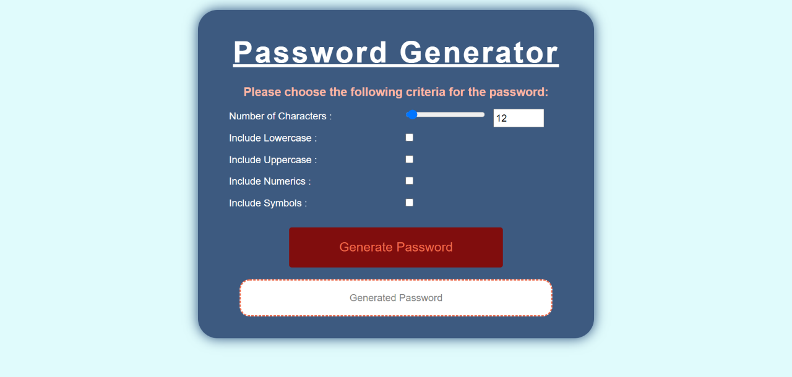

# PasswordGenerator

## Overview

In this project, student create a random password generator with several criteria:
* password must contain between 8 and 128 characters
* decide if password want to include uppercase and/or numericals and/or symbols characters

## Version History

* **Version 1.0 - 26 November 2020**
    * Added a sub heading below the Main Heading
    * Added a "include lowercase" options.
    * add an alert message if no option is choosen

* **Version 0.0 - 25 November 2020**
    Three initial source codes uploaded for the password generator:
    * index.html
    * style.css
    * script.js

## How it Works

1. Find the link provided below on the "Screenshoot and Links" section titled "Password Generator"

2. Click the link and open in browser

3. First, decide how many characters the password want to contain. Use the slider button to adjust the number of characters or type numbers directly into the provided box

4. Second, to include uppercase characters, tick the box on the right of "include uppercase", otherwise leave blank or untick

5. Third, to include uppercase characters, tick the box on the right of "include uppercase", otherwise leave blank or untick

6. Fourth, to include Numericals characters, tick the box on the right of "include numerics", otherwise leave blank or untick

7. Fifth, to include Symbols characters, tick the box on the right of "include symbols", otherwise leave blank or untick

8. After all criterias have been set, click the "Generate Password" button to generate a random password

9. The random generated password will be displayed in the white box below the "Generate Password" button

10. To Copy, use the mouse to click + hold and highlight the entire password, then right click mouse and copy or you can use the windows command ctrl+c to copy

11. Paste the password into the desired place.

12. If no criteria is choosen, the password generator will not work and alert message will pop up.

## Screenshot and Links

#### Screenshots
The following image shows the three pages appearance:

1. Password Generator ScreenShoot

#### Links
The following links will take you to the source code in github repository and the deployed live page:

* [Password Generator](https://vsumargo.github.io/PasswordGenerator/)

* [GitHub Source Code](https://github.com/vsumargo/PasswordGenerator)

## Acknowledgements

* **Trilogy Education Services & UWA Coding Bootcamp** - for design guides

* **Luca & Sam** - for their time in teaching HTML, CSS and Javascript

